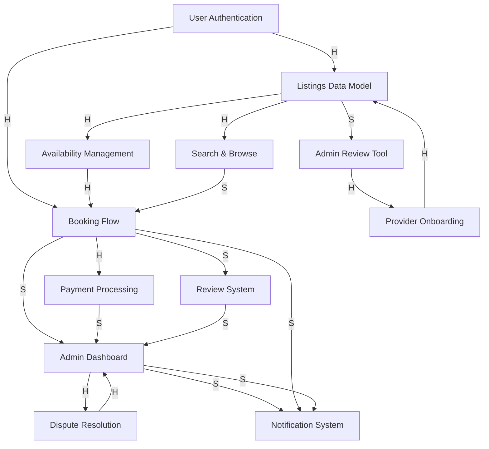

# Module 2: Dependency Graph - SkillSwap

## Work Items (13 items - split Admin Dashboard to fix circular dependency)

1. **User Authentication** - Registration, login, password management
2. **Listings Data Model** - Provider profiles, service descriptions, pricing structure, categories
3. **Provider Onboarding** - Vetting/approval process for new providers
4. **Availability Management** - Providers set time slots, conflict detection
5. **Search & Browse** - Category browsing, search with filters, "feels instant"
6. **Booking Flow** - Select provider, pick time slot, confirm booking
7. **Payment Processing** - Charge user, hold funds, 15% commission split
8. **Review System** - Users rate providers, providers flag no-show users
9. **Admin Review Tool (Minimal)** - Basic interface to approve/reject provider applications
10. **Admin Dashboard (Full)** - Analytics, dispute management, provider management
11. **Notification System** - Confirmation emails, booking reminders, cancellation notices
12. **Cancellation Flow** - Cancel booking, apply cancellation policy, handle refunds
13. **Dispute Resolution** - User-provider disagreements, admin escalation

## Dependency Graph (Mermaid)

## Edge Legend
- **H (Hard dependency)**: X MUST exist before Y can start
- **S (Soft dependency)**: X SHOULD exist before Y for convenience, but Y could start with a stub/mock

## Starting Points (no incoming dependencies)
- User Authentication (A)
- Provider Onboarding (C)

## Endpoints (no outgoing dependencies)
- Notification System (L)
- Admin Dashboard (J)

## Critical Path
A (Auth) → B (Listings) → I (Admin Review Tool) → C (Provider Onboarding) → D (Availability) → F (Booking) → G (Payment) → J (Cancellation) → K (Dispute) → J (Admin Dashboard) → L (Notifications)
Length: 11 items

**Note:** Circular dependency fixed by splitting Admin Dashboard into Admin Review Tool (Minimal) and Admin Dashboard (Full). The minimal tool unblocks provider onboarding, while the full dashboard can be built in parallel.
